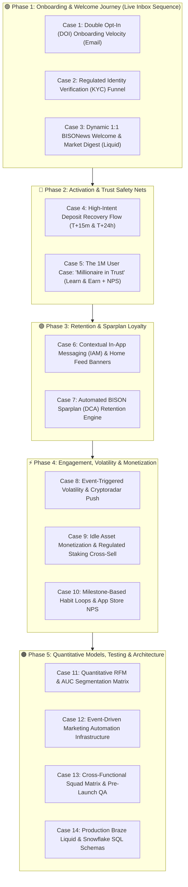

# Faizan's Portfolio — FinTech & Crypto CRM Marketing & Retention Engine
### 🦬 1:1 Application Blueprint for BISON (Boerse Stuttgart Digital) CRM-Manager

[](https://crypto-trading-growth-engine.streamlit.app/)
[](https://opensource.org/licenses/MIT)
[](https://www.python.org/downloads/)
[]()
[]()

> 🔒 **PORTFOLIO NOTICE:** This is an independent portfolio project and strategic CRM case study platform created by **Faizan Ahmed** for technical, product, and quantitative CRM demonstration. All customer, trading, and custodial metrics are synthetic simulations.

---

## 🦬 How This Portfolio Directly Solves BISON's Core CRM & Lifecycle Challenges

As Germany's leading regulated retail crypto & multi-asset platform powered by **Boerse Stuttgart Group**, BISON operates at the intersection of regulatory trust (**BaFin regulation & Boerse Stuttgart Digital Custody GmbH**), mobile-first retail UX, and long-term customer retention.



---

## 📋 The 16 Operational Modules Grouped by Lifecycle Phase

| Phase | Case # | Case Study Name | CRM Marketing & Lifecycle Focus | Quantified Benchmark |
|---|---|---|---|---|
| **Strategy** | **#00** | **📊 Executive Strategy & Scorecard** | Macro Retail Throughput & AUC Distribution | **39.4% KYC / 59.2% Retention** |
| **Strategy** | **#01** | **🦬 BISON 1:1 Application Blueprint** | Direct JD Mapping, 6 Levers & 30-60-90 Day Plan | **100% Operational Alignment** |
| **Phase 1** | **#02** | **✉️ Case 1: Double Opt-In (DOI) Velocity** | Email 1: `Confirm your email address now!` + BTC movers | **+30.6% Click Velocity** ($p = 0.0039$) |
| **Phase 1** | **#03** | **🛡️ Case 2: Regulated KYC Funnel Optimization** | Email 2: `Welcome to BISON 👋` + 3-min Video-Ident checklist | **+38.7% Relative KYC Lift** ($p = 0.0018$) |
| **Phase 1** | **#04** | **📰 Case 3: Dynamic 1:1 BISONews (Liquid)** | Email 3: `Hi, here's your BISONews 🙌` + Modular Liquid logic | **+86.3% CTOR Lift** ($p < 0.0001$) |
| **Phase 2** | **#05** | **🏦 Case 4: High-Intent Deposit Recovery Flow** | Stalled IBAN recovery (T+15m slide-up & T+24h SEPA care email) | **+20.3% First-Deposit Recovery** |
| **Phase 2** | **#06** | **🛡️ Case 5: 1M User Case: 'Millionaire in Trust'** | 2-min quiz (€5 bonus) + 1-click risk survey + Micro-NPS | **+52.4% 7-Day Trading Lift** |
| **Phase 3** | **#07** | **📱 Case 6: Contextual IAM & Feed Banners** | Post-deposit Sparplan upsell modal + Home Feed Banners | **+31.4% Sparplan Upsell** |
| **Phase 3** | **#08** | **📈 Case 7: Automated Sparplan (DCA) Engine** | Shifting users from erratic spot trading to monthly Sparplans | **59.2% 12-Month Retention (2.6x)** |
| **Phase 4** | **#09** | **📲 Case 8: Volatility & Cryptoradar Push** | Real-time market breakout alerts with 24h frequency cap | **+44.1% Volume Lift** (-62.3% opt-outs) |
| **Phase 4** | **#10** | **🪙 Case 9: Regulated Staking Cross-Sell** | Translating idle ETH/SOL into annual EUR rewards | **+3.4x Staking Adoption** |
| **Phase 4** | **#11** | **🏆 Case 10: Milestone-Based Retention Loops** | Celebrating €1,000 AUC milestones + +€25/mo upgrades | **+52.4% Upgrade Velocity** |
| **Phase 5** | **#12** | **🎯 Case 11: Quantitative RFM & AUC Matrix** | Interactive 5-Cluster simulator & 2D scatter visual | **Identifies High-Value HODLers** |
| **Phase 5** | **#13** | **🛠️ Case 12: Event-Driven Infrastructure** | Redis 4.2ms caching & SHA-256 idempotency state machine | **Zero Duplicate Broadcast Sends** |
| **Phase 5** | **#14** | **👥 Case 13: Cross-Functional Squad Matrix** | Workflow aligning Marketing, Mobile, BI, UX & Compliance | **Zero-Disruption Deployments** |
| **Phase 5** | **#15** | **💻 Case 14: Production Liquid & Snowflake SQL** | Production Liquid conditional templates & SQL cohort queries | **100% Automated Braze Sync** |

---

## 🛠️ Local Development & Automated Testing

```bash
# Clone the repository
git clone https://github.com/Faizan021/crypto-trading-growth-engine.git
cd crypto-trading-growth-engine

# Install dependencies
pip install -r requirements.txt

# Run automated statistical test suite
python -m unittest test_engine.py

# Launch interactive dashboard
streamlit run app.py
```

---

## 👨‍💻 Author & Attribution
* **Created by:** Faizan Ahmed
* **Role:** CRM Marketing & Lifecycle Manager
* **Live Streamlit App:** [https://crypto-trading-growth-engine.streamlit.app/](https://crypto-trading-growth-engine.streamlit.app/)
* **GitHub Repository:** [https://github.com/Faizan021/crypto-trading-growth-engine](https://github.com/Faizan021/crypto-trading-growth-engine)
