# Faizex Digital — Regulated Retail CRM Marketing & Retention Engine

[](https://crypto-trading-growth-engine.streamlit.app/)
[](https://opensource.org/licenses/MIT)
[](https://www.python.org/downloads/)
[]()
[]()

> 🔒 **PORTFOLIO NOTICE:** Faizex Digital is an independent portfolio project and case study platform created by **Faizan Ahmed** for technical, product, and quantitative CRM demonstration. All customer, trading, and custodial metrics are synthetic simulations.

---

## 🗺️ Full-Funnel Customer Lifecycle Marketing Architecture

```mermaid
flowchart TD
    subgraph S1["1. Acquisition & Verification (Activation Velocity)"]
        A["App Download & Lead Capture"] --> B["Stage 1: Double Opt-In (DOI) & Activation Velocity<br>(Live market movers in transactional DOI)"]
        B --> C["Stage 2: Regulated KYC Onboarding Funnel<br>(3-min Video-Ident checklist + deep-link)"]
    end

    subgraph S2["2. First Capital & Activation (Drop-off Rescue)"]
        C --> D["Stage 3: High-Intent Deposit Abandonment Flow<br>(T+15m IBAN slide-up & T+24h SEPA care)"]
        D --> E["Stage 4: Zero-Party Data, 'Learn & Earn' & NPS<br>(2-min quiz + €5 bonus + 1-click risk survey)"]
        E --> F["Stage 5: Contextual In-App Messaging (IAM)<br>(Post-deposit Sparplan upsell & FaceID)"]
    end

    subgraph S3["3. Habit Formation & LTV (Recurring Growth Engine)"]
        F --> G["Stage 6: Recurring DCA Sparplan Engine<br>(Payday recurring wealth cadence)"]
        G --> H["Stage 7: Event-Triggered Mobile Push Engine<br>(Breakouts, dips, yield spikes, DCA preview)"]
        H --> I["Stage 8: Cross-Sell Staking Yield Monetization<br>(Dynamic reward calculator for ETH/SOL/Cash)"]
        I --> J["Stage 9: Milestone-Based Retention Loops<br>(€1,000 AUC celebration + +€25/mo upgrade)"]
    end

    subgraph S4["4. Advocacy, Performance & Data Infrastructure"]
        J --> K["Stage 10: Dynamic 1:1 Personalized Newsletter<br>(Liquid conditional lifecycle CTAs)"]
        K --> L["Stage 11: Quantitative CRM Metrics & LTV/CAC<br>(TTFT, AUC Forecasting & Unit Economics)"]
        L --> M["Stage 12: Event-Driven CRM Architecture<br>(Redis cache & SHA-256 idempotency state machine)"]
        M --> N["Stage 13: Cross-Functional Squad Matrix<br>(BI, Mobile Product, UI/UX & BaFin compliance)"]
        N --> O["Stage 14: Production Liquid & SQL Schemas<br>(Snowflake cohort queries & Braze tags)"]
    end
```



---

## 📊 Strategic Enterprise CRM Lifecycle Matrix

| Operational Stage | Lifecycle Marketing Phase | Core Quantitative Problem | CRM Multi-Channel Solution | Quantified Benchmark Lift |
|---|---|---|---|---|
| **#01** | **Executive Summary: Strategy & Scorecard** | Macro Throughput & Custody Overview | Live Onboarding Funnel & AUC Distribution | **39.4% KYC Activation / 59.2% 12-Mo Retention** |
| **#02** | **Stage 1: Double Opt-In (DOI) Email Redesign** | 58.8% users delay KYC after confirming email | Live BTC/ETH market movers embedded in DOI verification | **+30.6% Click Velocity** ($z = 2.89, p = 0.0039$) |
| **#03** | **Stage 2: Breaking the KYC Drop-off** | BaFin Video-Ident creates cognitive friction | 3-step time-stamped checklist + mobile deep-linking | **+38.7% Relative KYC Lift** ($z = 3.12, p = 0.0018$) |
| **#04** | **Stage 3: High-Intent Deposit Recovery** | Verified users stall before first bank transfer | T+15m IBAN copy slide-up + T+24h SEPA care email | **+20.3% First-Deposit Recovery** (+64% Email CTR) |
| **#05** | **Stage 4: 'Learn & Earn' Quiz & Risk Profiling** | Beginners hesitate to deploy initial funds | 2-min quiz unlocking €5 bonus + 1-click risk profiling | **74.2% Completion** $	o$ **+52.4% 7-Day Trading Lift** |
| **#06** | **Stage 5: Contextual In-App Conversion Nudges** | Post-deposit drop-off and login friction | Post-deposit Sparplan upsell, FaceID, 3.2% cash yield | **+31.4% Sparplan Upsell / +42% Open Frequency** |
| **#07** | **Stage 6: The 5-Year Sparplan (DCA) Retention Engine** | 77% manual spot traders churn in bear markets | Automated Payday recurring Sparplan from €25/month | **2.6x Higher 12-Mo Retention (59.2% vs 22.8%)** |
| **#08** | **Stage 7: Event-Triggered Mobile Push (4 Scenarios)** | Push fatigue and opt-outs during market swings | 4 factual trading triggers + Limit Orders + 24h cap | **+44.1% Volume Lift** (-62.3% Opt-Outs) |
| **#09** | **Stage 8: Idle Staking Yield & Cash Activation** | Un-staked crypto sits dormant in custody | Dynamic annual reward calculator (+€72/yr ETH/SOL) | **+3.4x Staking Adoption (27.8% Conversion)** |
| **#10** | **Stage 9: Milestone Habit Loops & Goal Gradient** | Long-term savers lose motivation | €1,000 AUC milestone celebration + +€25/mo upgrade | **+52.4% Sparplan Upgrade Velocity** |
| **#11** | **Stage 10: Dynamic 1:1 Lifecycle Newsletter** | Generic static CTA underperforms | Dynamic Liquid tags matching user lifecycle persona | **+86.3% CTOR Lift** ($z = 4.15, p < 0.0001$) |
| **#12** | **Stage 11: Retention Metrics, Unit Economics & AUC Forecast** | Lack of long-term unit economic models | Quantitative forecasting (TTFT, AUC / Account, LTV) | **Institutional Custodial Compounding** |
| **#13** | **Stage 12: Event-Driven Infrastructure & Idempotency** | Duplicate sends during 100k+ broadcasts | Redis caching (4.2ms) + SHA-256 idempotency keys | **100% Crash-Resilient Delivery** |
| **#14** | **Stage 13: Cross-Functional Squad Execution Matrix** | Siloed delivery between Engineering and CRM | Unified growth squad (BI, Mobile, UI, BaFin) | **Zero-Disruption Production Deployments** |
| **#15** | **Stage 14: Production Liquid & Snowflake SQL Schemas** | Manual cohort extraction bottlenecks | Production-ready Liquid blocks and Snowflake SQL | **100% Automated Lifecycle Synchronization** |

---

## 🛠️ Local Development & Automated Testing

```bash
# Clone the repository
git clone https://github.com/Faizan021/crypto-trading-growth-engine.git
cd crypto-trading-growth-engine

# Install dependencies
pip install -r requirements.txt

# Run automated statistical test suite
python -m unittest test_engine.py

# Launch interactive dashboard
streamlit run app.py
```

---

## 👨‍💻 Author & Attribution
* **Created by:** Faizan Ahmed
* **Role:** Lead CRM Marketing & Lifecycle Growth Engineer
* **Live Streamlit App:** [https://crypto-trading-growth-engine.streamlit.app/](https://crypto-trading-growth-engine.streamlit.app/)
* **GitHub Repository:** [https://github.com/Faizan021/crypto-trading-growth-engine](https://github.com/Faizan021/crypto-trading-growth-engine)
