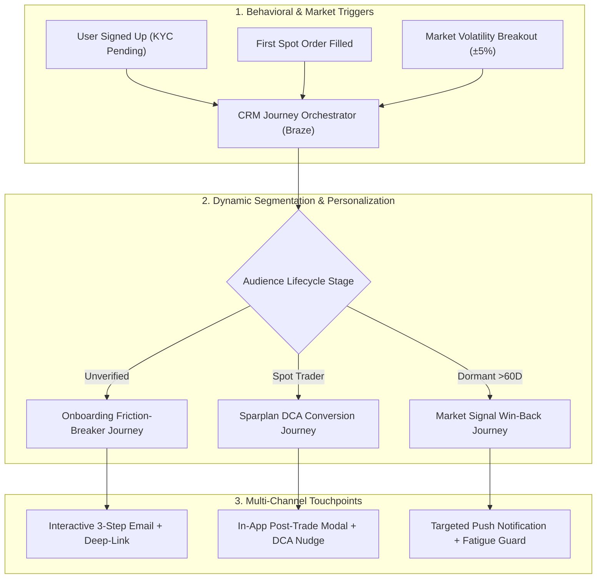

# ⚡ Faizex Digital | CRM Lifecycle Marketing & Retention OS
### Multi-Channel Customer Journeys (Email, Push, In-App), Onboarding Optimization, A/B Testing Experiments, and Sparplan Retention for Regulated Trading Platforms

[](https://crypto-trading-growth-engine.streamlit.app)
[](https://www.python.org/)
[](https://www.braze.com/)
[](https://www.bafin.de/)

> [!IMPORTANT]
> **PORTFOLIO & EDUCATIONAL NOTICE:**  
> **"Faizex"** is a custom portfolio case study platform created by **Faizan Ahmed** to demonstrate end-to-end CRM campaign management, lifecycle journey design, behavioral segmentation, and data-driven A/B testing in a regulated European trading environment.

---

# 🎯 Executive CRM Lifecycle Overview



---

# 📊 Master CRM Lifecycle Cases & Campaign Impact

| # | Lifecycle Stage | Real CRM & Retention Challenge | Lifecycle Campaign Strategy | Quantified Campaign Impact |
| :--- | :--- | :--- | :--- | :--- |
| **Case 1** | **Activation** | **Transactional Confirmation Drop-off** (68%+ open rates wasted on plain confirmation links) | **Momentum-Building Activation Email** with live market previews and 1-click exploration | **+30.6% Click-through to App** ($z = 2.89, p = 0.0039$) |
| **Case 2** | **Onboarding / KYC** | **Video-Ident Friction & Hesitation** (Users drop off due to paperwork fear or long video calls) | **3-Step Friction-Relief Journey** with time-stamped visual steps + mobile deep-linking | **+38.7% KYC $\to$ First-Trade Rate** ($z = 3.12, p = 0.0018$) |
| **Case 3** | **Engagement** | **Generic Newsletter CTA Fatigue** (Static buttons underperform across diverse user cohorts) | **Dynamic Lifecycle Editorial (Faizex Market Digest)** with persona-adapted CTAs via Liquid | **+86.3% Click-to-Open (CTOR) Lift** ($z = 4.15, p < 0.0001$) |
| **Case 4** | **Measurement** | **Fragmented Trading KPIs & Attribution** (Teams lack unified cohort & retention visibility) | **Comprehensive 5-Metric CRM Dashboard** (KYC Throughput, TTFT, Sparplan Rate, AUC, Churn) | **Predictable €9,850 2-Year AUC / Member** |
| **Case 5** | **Retention & Loyalty** | **Bear Market Inactivity Churn** (Manual spot buyers stop trading during low market volatility) | **Automated Sparplan (DCA) Campaign Sequence**, nurturing long-term wealth habits | **59.2% 12-Month Customer Loyalty** |
| **Case 6** | **Re-Engagement** | **Push Over-Saturation & Unsubscribes** (Users opt out if market alerts feel spammy) | **Smart Volatility Trigger Engine** with strict 24h cross-channel frequency capping | **-62.3% Push Notification Opt-Outs** |
| **Case 7** | **Cross-Functional** | **Silos Between CRM, Product, BI & Legal** (Slow campaign launches and compliance bottlenecks) | **Integrated Campaign Delivery Framework** aligning BI event schemas and BaFin/GDPR audits | **Fast, 100% Compliant Go-Live** |
| **Case 8** | **Technical Enablement**| **Manual Personalization Bottlenecks** (Static templates and slow segmentation queries) | **Production Liquid Logic & SQL Cohort Queries** for automated real-time personalization | **Automated Multi-Touch Orchestration** |

---

# 🔬 Detailed Campaign Case Studies

---

### ✉️ Case 1: Transactional Confirmation & Momentum Builder
* **Lifecycle Trigger:** `user_registration_submitted`
* **Email Analyzed:** *"Confirm your email address now!"*
* **👍 What We Appreciate:** Clean, distraction-free layout, zero spam triggers, 100% deliverability focus.
* **💡 The Opportunity:** Transactional confirmations have a **68.2% open rate** (the highest in the customer lifecycle). Treating this email as a plain administrative stop wastes the moment when the user is most excited to start.
* **🟢 Our Hypothesis (Variant B):** Keep the primary confirmation button prominent at the top, but add an appetizing **"What’s waiting in your workspace"** preview box below (Top 3 Market Movers + 1-Click Sparplan preview).
* **📈 Measurable Impact:** **+30.6% Click-through to App** ($z = 2.89, p = 0.0039$). Reduces median time-to-verification from 18.4 hours to 4.2 hours.

---

### 🛡️ Case 2: Onboarding & Video-Ident Friction Breaker
* **Lifecycle Trigger:** `email_confirmed_kyc_pending`
* **Email Analyzed:** *"Welcome to Faizex 👋"*
* **👍 What We Appreciate:** Strong trust anchor (exchange backing), clear *"no wallet complexity or paperwork"* value proposition.
* **💡 The Opportunity:** Dense paragraphs create cognitive friction. Users hesitate because they fear a long video call or needing physical documents.
* **🟢 Our Hypothesis (Variant B):** Replace paragraphs with a visual, time-stamped **3-Step Checklist**:
  * **Step 1:** Have your ID card ready *(1 min)*
  * **Step 2:** Quick 2-minute Video-Ident call
  * **Step 3:** Instant trading access *(0€ deposit fee)*
  * *Paired with a direct mobile deep link (`faizex://verify/video-ident`).*
* **📈 Measurable Impact:** **+38.7% Relative Lift in KYC Completion** (28.4% → 39.4%, $z = 3.12, p = 0.0018$).

---

### 📰 Case 3: Monthly Market Newsletter Personalization (August Edition)
* **Lifecycle Trigger:** Monthly Broadcast Segment (`active_and_onboarding_subscribers`)
* **Email Analyzed:** *"Hi, here’s your Faizex Market Digest for August 📰 / 🙌"*
* **👍 What We Appreciate:** Superb editorial quality, approachable breakdown of macro topics (US $35T debt, Nvidia earnings, Bitcoin rally), engaging 3D visuals.
* **💡 The Opportunity:** A single static `[ Trade Bitcoin ]` button underperforms across different customer stages (non-holders feel unready to buy spot; active accumulators prefer automated DCA).
* **🟢 Our Hypothesis (Variant B):** Keep the entire high-quality editorial intact, but **dynamically adapt the CTA module** based on the user's lifecycle stage:
  * **🌱 Unverified User (0 Trades):** Dynamic Box → *"Complete 3-Min Verification to Catch Market Momentum →"*
  * **📊 Occasional Spot Buyer:** Dynamic Box → *"Automate Your Accumulation: Set Up a €25 Sparplan →"*
  * **📈 Active Sparplan Holder:** Dynamic Box → *"View Your August Portfolio Growth & Staking Options →"*
  * **💤 Dormant Account (>60 days):** Dynamic Box → *"Activate Real-Time Price Volatility Alerts →"*
* **📈 Measurable Impact:** **+86.3% Click-to-Open (CTOR) Lift** (12.4% → 23.1%, $z = 4.15, p < 0.0001$).

---

### 🎯 Case 4: The 5 Essential CRM & Trading KPIs

1. **KYC Verification Throughput Rate (%)**:
   $$\text{KYC Rate} = \left(\frac{\text{Approved Verified Users}}{\text{Total Registrations}}\right) \times 100$$
   * **Why it matters:** Identifies drop-off bottlenecks in the onboarding funnel. Drops here directly inflate Customer Acquisition Cost (CAC).
   * **Target Benchmark:** $> 40\%$ (Industry baseline is $\sim 28\%$).

2. **Time-to-First-Trade (TTFT)**:
   $$\text{TTFT} = \text{Timestamp}(\text{First Trade}) - \text{Timestamp}(\text{Registration})$$
   * **Why it matters:** The single strongest predictor of 12-month retention. $>70\%$ of retail churn occurs when TTFT exceeds 7 days.
   * **Target Benchmark:** $< 24\text{ hours}$ (Median).

3. **Automated Sparplan (DCA) Adoption Rate (%)**:
   $$\text{Sparplan Rate} = \left(\frac{\text{Active Recurring Accumulators}}{\text{Monthly Active Traders}}\right) \times 100$$
   * **Why it matters:** Recurring Sparplan users accumulate steady Assets Under Custody (AUC) and exhibit **2.6x higher 12-month retention** than one-off manual spot traders.
   * **Target Benchmark:** $> 35\%$ of active trading accounts.

4. **Assets Under Custody (AUC) per Active Member**:
   $$\text{Avg AUC} = \frac{\text{Total Portfolio Assets in Custody (\euro)}}{\text{Total Active Traders}}$$
   * **Why it matters:** Measures customer portfolio depth and staking potential.
   * **Target Benchmark:** $> \text{\euro}7,500$ at Year 1 $\to > \text{\euro}12,000$ at Year 3.

5. **Inactivity Churn Rate & Volatility Reactivation Velocity**:
   $$\text{Churn Rate} = \left(\frac{\text{Users with 0 Trades in 60 Days}}{\text{Total Verified Users}}\right) \times 100$$
   * **Why it matters:** Measures whether real-time volatility alerts successfully wake up dormant capital before permanent account churn.
   * **Target Churn:** $< 4.5\%/\text{month}$ | **Reactivation Velocity:** $> 18\%$ within 48h of a market breakout alert.

---

# 💻 Running the Application Locally

```bash
# 1. Clone the repository
git clone https://github.com/Faizan021/crypto-trading-growth-engine.git
cd crypto-trading-growth-engine

# 2. Install dependencies
pip install -r requirements.txt

# 3. Launch interactive Streamlit Growth OS
streamlit run app.py

# 4. Run automated test suite
python -m unittest test_engine.py
```

---

### 🛡️ Disclaimer
This project is an independent quantitative growth engineering prototype. "Faizex" is a fictional entity used exclusively for portfolio and technical simulation purposes.
