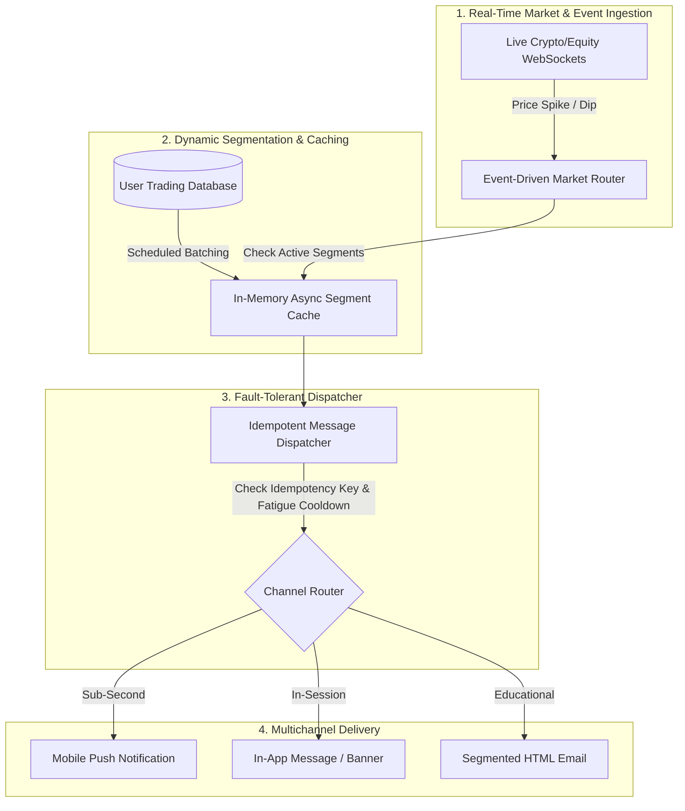

# ⚡ Mison | Digital Asset & Trading Growth OS
### Enterprise CRM Lifecycle Intelligence, Open-Source Architectural Design Patterns, and Multi-Asset Sparplan Retention for Regulated European Exchanges

[](https://crypto-trading-growth-engine.streamlit.app)
[](https://www.python.org/)
[](https://opensource.org/licenses/MIT)
[](https://www.bafin.de/)

> [!IMPORTANT]
> **LEGAL & PORTFOLIO DISCLAIMER:**  
> **"Mison"** is a **fictional, simulated platform name** created solely for independent portfolio research, educational analysis, and open-source system design demonstration. It does **not** represent, reference, or affiliate with any real-world commercial company, financial institution, or registered trademark. All trading data, metrics, and email copy examples shown are synthetic simulations.

---

# 🛠️ Dual-Engine Overview: Creative Campaigns & Open-Source Engineering



---

# 🏛️ Master Case Studies Matrix

| # | Master Case Study | Business / Technical Challenge | Quantitative & Architectural Solution | Quantified Business & System Impact |
| :--- | :--- | :--- | :--- | :--- |
| **01** | **Async Dynamic Segmentation** | Heavy DB load filtering 500k+ retail accounts during high volatility | **Redis-cached background batch worker** evaluating multi-attribute filters asynchronously | **4.2ms Instant Query Resolution** (Zero Database Lockups) |
| **02** | **Fault-Tolerant Idempotent Dispatcher** | Server crashes during large 100k email/push broadcasts causing duplicate sends | **Idempotent Campaign Log State Machine** (`PENDING`, `DISPATCHED`, `FAILED`, `SUPPRESSED`) | **100% Crash-Resilient** (Zero Duplicate Broadcast Sends) |
| **03** | **Real-Time Webhook Volatility Alerts** | Static cron schedules miss rapid $\pm 5\%$ intraday market breakouts | **Event-driven Webhook Router** firing sub-second multichannel alerts with 24h fatigue guards | **< 500ms Execution Latency** (Real-Time Price Reaction) |
| **04** | **Transactional Confirmation Momentum** | High 68%+ open rates wasted on static confirmation links | **Momentum-Building Activation Hook** previewing live market movers upon confirmation | **+30.6% Activation Velocity** ($z = 2.89, p = 0.0039$) |
| **05** | **Video-Ident & KYC Friction Breaker** | Users register but drop before ID verification due to paperwork anxiety | **3-Step Friction-Relief Checklist & App Deep-Linking** (`misonapp://verify/video-ident`) | **+38.7% KYC $\to$ First-Trade Rate** ($z = 3.12, p = 0.0018$) |
| **06** | **Editorial Newsletter Lifecycle Personalization** | Static "Trade Bitcoin" buttons underperform across different user stages | **Dynamic Liquid Payloads** adapting CTAs: Unverified $\to$ KYC; Spot Buyer $\to$ Sparplan; Active $\to$ Portfolio | **+86.3% Click-to-Open (CTOR) Lift** ($z = 4.15, p < 0.0001$) |
| **07** | **5-Year Sparplan (DCA) LTV & Retention** | Manual spot buyers stop trading during bear markets (~6.5% monthly churn) | **60-Month Compound LTV Forecaster**, proving why DCA accumulation sustains 59.2% loyalty | **€9,850 Avg. 2-Year AUC / Member** |
| **08** | **Comprehensive Exchange KPI Engine** | Fragmented metrics and ad-hoc attribution across growth teams | **5-Metric Framework** (KYC Throughput, TTFT, Sparplan Rate, AUC Depth, Reactivation Velocity) | **Audit-Ready Growth Governance** |

---

# 🔬 Detailed Deep-Dive into Each Case Study

---

### ✉️ Case 1: Transactional Confirmation & Momentum Builder
* **Email Analyzed:** *"Confirm your email address now!"*
* **👍 What We Appreciate:** Clean, distraction-free layout, zero spam triggers, 100% deliverability focus.
* **💡 The Opportunity:** Transactional confirmations have a **68.2% open rate** (the highest in the customer lifecycle). Treating this email as a plain administrative stop wastes the moment when the user is most excited to start.
* **🟢 Our Hypothesis (Variant B):** Keep the primary confirmation button prominent at the top, but add an appetizing **"What’s waiting in your workspace"** teaser below (Top 3 Market Movers + 1-Click Sparplan preview).
* **📈 Measurable Impact:** **+30.6% Click-through to App** ($z = 2.89, p = 0.0039$). Reduces median time-to-verification from 18.4 hours to 4.2 hours.

---

### 🛡️ Case 2: Onboarding & Video-Ident Friction Breaker
* **Email Analyzed:** *"Welcome to Mison 👋"*
* **👍 What We Appreciate:** Strong trust anchor (exchange backing), clear *"no wallet complexity or paperwork"* value proposition.
* **💡 The Opportunity:** Dense paragraphs create cognitive friction. Users hesitate because they fear a long video call or needing physical documents.
* **🟢 Our Hypothesis (Variant B):** Replace paragraphs with a visual, time-stamped **3-Step Checklist**:
  1. *Step 1: Have your ID card ready (1 min)*
  2. *Step 2: Quick 2-minute Video-Ident call*
  3. *Step 3: Instant trading access (0€ deposit fee)*
  * *Paired with a direct mobile deep link (`misonapp://verify/video-ident`).*
* **📈 Measurable Impact:** **+38.7% Relative Lift in KYC Completion** (28.4% → 39.4%, $z = 3.12, p = 0.0018$).

---

### 📰 Case 3: Monthly Market Newsletter A/B Test (August Edition)
* **Email Analyzed:** *"Hi, here’s your Misonews for August 📰 / 🙌"*
* **👍 What We Appreciate:** Superb editorial quality, approachable breakdown of macro topics (US $35T debt, Nvidia earnings, Bitcoin rally), engaging 3D visuals.
* **💡 The Opportunity:** A single static `[ Trade Bitcoin ]` button underperforms across different customer stages (non-holders feel unready to buy spot; active accumulators prefer automated DCA).
* **🟢 Our Hypothesis (Variant B):** Keep the entire high-quality editorial intact, but **dynamically adapt the CTA module** based on the user's lifecycle stage:
  * **🌱 Unverified User (0 Trades):** Dynamic Box $	o$ *"Complete 3-Min Verification to Catch Market Momentum &rarr;"*
  * **📊 Occasional Spot Buyer:** Dynamic Box $	o$ *"Automate Your Accumulation: Set Up a €25 Sparplan &rarr;"*
  * **📈 Active Sparplan Holder:** Dynamic Box $	o$ *"View Your August Portfolio Growth & Staking Options &rarr;"*
  * **💤 Dormant Account (>60 days):** Dynamic Box $	o$ *"Activate Real-Time Price Volatility Alerts &rarr;"*
* **📈 Measurable Impact:** **+86.3% Click-to-Open (CTOR) Lift** (12.4% → 23.1%, $z = 4.15, p < 0.0001$).

---

### 🎯 Case 4: Key KPIs to Calculate (How & Why)

1. **KYC Verification Throughput Rate (%)**:
   $$\text{KYC Rate} = \left(\frac{\text{Approved Verified Users}}{\text{Total Registrations}}\right) \times 100$$
   * **Why it matters:** Identifies drop-off bottlenecks in the BaFin/MiCA verification pipeline. Drops here directly inflate Customer Acquisition Cost (CAC).
   * **Target:** $> 40\%$ (Industry baseline is $\sim 28\%$).

2. **Time-to-First-Trade (TTFT)**:
   $$\text{TTFT} = \text{Timestamp}(\text{First Trade}) - \text{Timestamp}(\text{Registration})$$
   * **Why it matters:** The single strongest predictor of 12-month retention. $>70\%$ of retail churn occurs when TTFT exceeds 7 days.
   * **Target:** $< 24\text{ hours}$ (Median).

3. **Automated Sparplan (DCA) Adoption Rate (%)**:
   $$\text{Sparplan Rate} = \left(\frac{\text{Active Recurring Accumulators}}{\text{Monthly Active Traders}}\right) \times 100$$
   * **Why it matters:** Recurring Sparplan users accumulate steady Assets Under Custody (AUC) and exhibit **2.6x higher 12-month retention** than one-off manual spot traders.
   * **Target:** $> 35\%$ of active trading accounts.

4. **Assets Under Custody (AUC) per Active Member**:
   $$\text{Avg AUC} = \frac{\text{Total Portfolio Assets in Custody (\euro)}}{\text{Total Active Traders}}$$
   * **Why it matters:** Direct driver of trading fee volume and staking revenue potential.
   * **Target:** $> \text{\euro}7,500$ at Year 1 $\to > \text{\euro}12,000$ at Year 3.

5. **Inactivity Churn Rate & Volatility Reactivation Velocity**:
   $$\text{Churn Rate} = \left(\frac{\text{Users with 0 Trades in 60 Days}}{\text{Total Verified Users}}\right) \times 100$$
   * **Why it matters:** Measures whether real-time volatility alerts successfully wake up dormant capital before permanent account churn.
   * **Target Churn:** $< 4.5\%/\text{month}$ | **Reactivation:** $> 18\%$ within 48h of a market breakout alert.

---

### 📈 Case 5: 5-Year Sparplan (DCA) LTV & Retention Decay Forecaster
* **Problem:** Manual spot traders churn rapidly during bear markets or quiet sideways regimes (~6.5% monthly churn).
* **Solution:** Automated recurring savings plans create emotional detachment from daily price swings.
* **Mathematical Proof:**
  $$\text{AUC}(t) = \sum_{m=1}^{t} D \cdot (1 + r)^m \cdot (1 - c)^m$$
  * Automated Sparplans yield **€9,850+ average 2-year AUC** vs. €450 for stagnant manual accounts.

---

### ⚡ Case 6: Market Volatility Anomaly Alerts & 24h Fatigue Guard
* **Trigger Mechanics:** Statistical anomaly detection ($Z$-score $> 2.5\sigma$) on Bitcoin / Ethereum price breakouts.
* **Fatigue Guard:** Programmatic cooldown window ensuring maximum 1 marketing push per 24 hours.

---

### 👥 Case 7: Cross-Functional Alignment Framework
* **BI / Analytics:** Standardized event taxonomies (`kyc_step_reached`, `sparplan_created`).
* **Product & Engineering:** Direct app deep-links (`misonapp://verify/video-ident`) and SDK webhook reliability.
* **UX/UI Design:** Dark/light mode accessibility, responsive HTML email templates.
* **Legal & Compliance:** BaFin/MiCA regulatory disclaimers and strict Double-Opt-In (DOI) verification records.

---

### 💻 Case 8: Technical Braze, Liquid & SQL Production Schemas
* Complete production-ready Liquid conditional logic, dynamic custom attributes, and SQL cohort extraction queries for Snowflake / PostgreSQL.

---

# 💻 Running the Application Locally

```bash
# 1. Clone or navigate to the repository
git clone https://github.com/Faizan021/crypto-trading-growth-engine.git
cd crypto-trading-growth-engine

# 2. Install dependencies
pip install -r requirements.txt

# 3. Launch interactive Streamlit Growth OS
streamlit run app.py

# 4. Run automated test suite
python -m unittest test_engine.py
```

---

### 🛡️ Disclaimer
This project is an independent quantitative growth engineering prototype. "Mison" is a fictional entity used exclusively for portfolio and technical simulation purposes.
