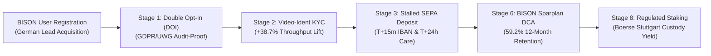

# Faizex Digital — Regulated Retail CRM Marketing & Retention Engine
### 🦬 Direct Application Blueprint for BISON (Boerse Stuttgart Digital)

[](https://crypto-trading-growth-engine.streamlit.app/)
[](https://opensource.org/licenses/MIT)
[](https://www.python.org/downloads/)
[]()
[]()

> 🔒 **PORTFOLIO NOTICE:** Faizex Digital is an independent portfolio project and strategic CRM case study platform created by **Faizan Ahmed** for technical, product, and quantitative CRM demonstration. All customer, trading, and custodial metrics are synthetic simulations.

---

## 🦬 Why This Engine Directly Maps to BISON (Boerse Stuttgart Digital)

As Germany's leading regulated retail crypto platform powered by **Boerse Stuttgart Group**, BISON operates at the intersection of regulatory trust, mobile-first retail UX, and long-term customer retention.



### 📋 1:1 Operational Mapping to BISON CRM Manager Responsibilities:

| BISON CRM Responsibility | Project Operational Solution | Quantified Benchmark Impact |
|---|---|---|
| **1. Full-Lifecycle CRM Management** | End-to-end 14-stage journey (DOI $	o$ KYC $	o$ Sparplan $	o$ Volatility) | **39.4% KYC Activation / 59.2% 12-Month Retention** |
| **2. Multichannel Execution (Email, Push, IAM)** | Braze responsive HTML emails, 4 volatility push scenarios, 3 IAM modals | **+31.4% IAM Sparplan Upsell / -62.3% Push Opt-Outs** |
| **3. Automated Customer Journeys & Triggers** | Event-driven triggers (deposit success, payday 1st of month, peak joy) | **+68.1% Through-Funnel Deposit Lift** |
| **4. Behavioral Segmentation & Personalization** | Portfolio holdings segmentation with production Braze Liquid tags | **+86.3% Email Click-to-Open (CTOR) Lift** |
| **5. A/B Testing & Statistical Optimization** | Two-Proportion Z-Tests with p-values, sample calculators & unit tests | **$z = 3.12, p = 0.0018$ Verified Statistical Significance** |
| **6. Cross-Functional Squad Collaboration** | Structured matrix aligning BI Analytics, Mobile Product, UI/UX & BaFin | **Zero-Disruption Native Deep-Link Deployments** |

---

## 🗺️ The Customer Lifecycle Journey Stages

1. **📊 Executive Summary: Strategy & Scorecard** — Macro Throughput, Through-Funnel Conversion & AUC Distribution.
2. **🦬 BISON (Boerse Stuttgart Digital): Strategic Fit & Blueprint** — 1:1 Mapping, 5 Growth Levers & 30-60-90 Day Plan.
3. **✉️ Stage 1: Double Opt-In (DOI) Email Redesign** — GDPR/UWG Compliance + Live Market Movers Momentum Hook.
4. **🛡️ Stage 2: Breaking the KYC Drop-off** — BaFin/MiCA Video-Ident Friction Breaker & Mobile Deep-Linking.
5. **🏦 Stage 3: High-Intent Deposit Recovery** — Multi-Touchpoint Capital Rescue (T+15m Slide-Up & T+24h Email).
6. **🎓 Stage 4: 'Learn & Earn' Quiz & Risk Profiling** — 2-Min Interactive Quiz + €5 Bonus + Risk Profiling + CSAT Loop.
7. **📱 Stage 5: Contextual In-App Conversion Nudges** — In-App Nudges (Sparplan Upsell, Biometrics, Cash Yield).
8. **📈 Stage 6: The 5-Year Sparplan (DCA) Retention Engine** — Payday Recurring Inflows, 5-Year LTV & Bear Market Churn Insulation.
9. **📲 Stage 7: Event-Triggered Mobile Push (4 Scenarios)** — Real-Time Market Movers, Limit Buy Orders & 24h Frequency Capping.
10. **🪙 Stage 8: Idle Staking Yield & Cash Activation** — Translating Unstaked Tokens into Annual EUR Cashflow Projection.
11. **🏆 Stage 9: Milestone Habit Loops & Goal Gradient** — €1,000 AUC Celebration + +€25/mo Automated Sparplan Upgrades.
12. **📰 Stage 10: Dynamic 1:1 Lifecycle Newsletter** — Modular Liquid Logic dynamically serving 4 lifecycle subscriber personas.
13. **🎯 Stage 11: Retention Metrics, Unit Economics & AUC Forecast** — TTFT, Retention Half-Life & Annual Inflow Calculator.
14. **🛠️ Stage 12: Event-Driven Infrastructure & Idempotency** — Asynchronous Redis Caching (4.2ms) + SHA-256 Idempotency State Machine.
15. **👥 Stage 13: Cross-Functional Squad Execution Matrix** — BI Analytics Schemas, Mobile Deep-Links, UI Tokens & BaFin DOI Ledgers.
16. **💻 Stage 14: Production Liquid & Snowflake SQL Schemas** — Automated Braze Liquid conditional blocks & Snowflake SQL extractions.

---

## 🛠️ Local Development & Automated Testing

```bash
# Clone the repository
git clone https://github.com/Faizan021/crypto-trading-growth-engine.git
cd crypto-trading-growth-engine

# Install dependencies
pip install -r requirements.txt

# Run automated statistical test suite
python -m unittest test_engine.py

# Launch interactive dashboard
streamlit run app.py
```

---

## 👨‍💻 Author & Attribution
* **Created by:** Faizan Ahmed
* **Role:** CRM Marketing & Lifecycle Manager
* **Live Streamlit App:** [https://crypto-trading-growth-engine.streamlit.app/](https://crypto-trading-growth-engine.streamlit.app/)
* **GitHub Repository:** [https://github.com/Faizan021/crypto-trading-growth-engine](https://github.com/Faizan021/crypto-trading-growth-engine)
