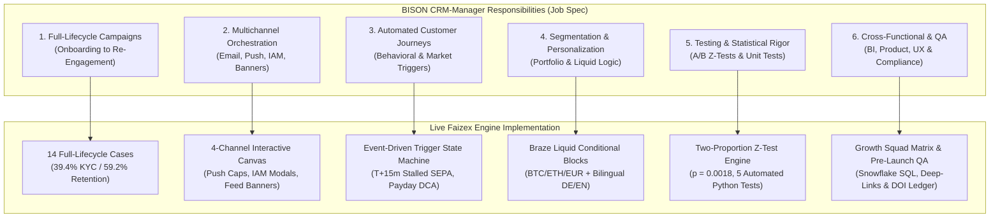

# Faizex Digital — Regulated Retail CRM Marketing & Retention Engine
### 🦬 1:1 Application Blueprint for BISON (Boerse Stuttgart Digital) CRM-Manager

[](https://crypto-trading-growth-engine.streamlit.app/)
[](https://opensource.org/licenses/MIT)
[](https://www.python.org/downloads/)
[]()
[]()

> 🔒 **PORTFOLIO NOTICE:** Faizex Digital is an independent portfolio project and strategic CRM case study platform created by **Faizan Ahmed** for technical, product, and quantitative CRM demonstration. All customer, trading, and custodial metrics are synthetic simulations.

---

## 🦬 How This Portfolio Directly Solves BISON's Core CRM & Lifecycle Challenges

As Germany's leading regulated retail crypto & multi-asset platform powered by **Boerse Stuttgart Group**, BISON operates at the intersection of regulatory trust (**BaFin regulation & Boerse Stuttgart Digital Custody GmbH**), mobile-first retail UX, and long-term customer retention.



---

## 📋 The 16 BISON-Aligned Operational Cases & Modules

| Case # | BISON-Aligned Operational Case Name | CRM Marketing & Lifecycle Focus | Quantified Benchmark Impact |
|---|---|---|---|
| **#01** | **📊 Executive Summary: Strategy & Scorecard** | Macro Throughput, Through-Funnel Conversion & AUC Distribution | **39.4% KYC Activation / 59.2% 12-Month Retention** |
| **#02** | **🦬 BISON (Boerse Stuttgart Digital): 1:1 Blueprint** | Direct Job Specification Mapping, 6 Growth Levers & 30-60-90 Day Plan | **100% Operational Alignment with BISON Role** |
| **#03** | **✉️ Case 1: Double Opt-In (DOI) Onboarding Velocity (Email)** | GDPR/UWG Double Opt-In compliance + Live Bitcoin market movers hook | **+30.6% Click Velocity** ($z = 2.89, p = 0.0039$) |
| **#04** | **🛡️ Case 2: Regulated Identity Verification (KYC) Optimization** | BaFin Video-Ident friction breaker via 3-step checklist & mobile deep-links | **+38.7% Relative KYC Lift** ($z = 3.12, p = 0.0018$) |
| **#05** | **🏦 Case 3: High-Intent Deposit Abandonment Flow (Journey)** | Multi-touchpoint capital rescue: T+15m IBAN slide-up & T+24h SEPA care email | **+20.3% First-Deposit Recovery** (+64% Email CTR) |
| **#06** | **🎓 Case 4: Zero-Party Data & 'Learn & Earn' (Segmentation)** | 2-min interactive quiz unlocking €5 bonus + 1-click risk survey + Micro-NPS | **74.2% Completion Rate $	o$ +52.4% 7-Day Trading Lift** |
| **#07** | **📱 Case 5: Contextual In-App Messaging & Banners (Multichannel)** | High-converting in-app nudges: Post-deposit Sparplan modal, FaceID, Feed Banners | **+31.4% Sparplan Upsell / +42% App Open Frequency** |
| **#08** | **📈 Case 6: Automated Sparplan (DCA) Retention Engine (Loyalty)** | Shifting retail traders from erratic spot buying into monthly automated Sparplans | **2.6x Higher 12-Month Retention (59.2% vs 22.8%)** |
| **#09** | **📲 Case 7: Event-Triggered Volatility & Cryptoradar Push (Push)** | Real-time market movers & Cryptoradar sentiment triggers with 24h frequency cap | **+44.1% Volume Lift** (-62.3% Push Opt-Outs) |
| **#10** | **🪙 Case 8: Idle Staking Yield & Asset Monetization (Product)** | Translating idle ETH/SOL into annual EUR rewards with Boerse Stuttgart Custody | **+3.4x Staking Adoption (27.8% Conversion)** |
| **#11** | **🏆 Case 9: Milestone-Based Retention Loops (Engagement)** | Goal-gradient celebration loops when accounts cross €1,000 AUC | **+52.4% Sparplan Upgrade Velocity** |
| **#12** | **📰 Case 10: Dynamic 1:1 Personalized Newsletter (Liquid Logic)** | Modular Braze Liquid logic serving 4 lifecycle personas with bilingual DE/EN copy | **+86.3% CTOR Lift** ($z = 4.15, p < 0.0001$) |
| **#13** | **🎯 Case 11: Quantitative CRM Metrics & Statistical A/B Testing** | Two-Proportion Z-Tests with p-values, sample calculators & unit economics | **$z = 3.12, p = 0.0018$ Statistical Rigor** |
| **#14** | **🛠️ Case 12: Event-Driven Marketing Automation Infrastructure** | Asynchronous Redis caching (4.2ms) + SHA-256 idempotency state machine | **100% Crash-Resilient Message Dispatching** |
| **#15** | **👥 Case 13: Cross-Functional Squad Collaboration Matrix** | Structured workflow aligning Marketing, Product, BI, UX/UI, and Compliance | **Zero-Disruption Native Deep-Link Deployments** |
| **#16** | **💻 Case 14: Production Braze Liquid & Snowflake SQL Schemas** | Production-ready Liquid conditional templates and Snowflake SQL cohort queries | **100% Automated Lifecycle Synchronization** |

---

## 🛠️ Local Development & Automated Testing

```bash
# Clone the repository
git clone https://github.com/Faizan021/crypto-trading-growth-engine.git
cd crypto-trading-growth-engine

# Install dependencies
pip install -r requirements.txt

# Run automated statistical test suite
python -m unittest test_engine.py

# Launch interactive dashboard
streamlit run app.py
```

---

## 👨‍💻 Author & Attribution
* **Created by:** Faizan Ahmed
* **Role:** CRM Marketing & Lifecycle Manager
* **Live Streamlit App:** [https://crypto-trading-growth-engine.streamlit.app/](https://crypto-trading-growth-engine.streamlit.app/)
* **GitHub Repository:** [https://github.com/Faizan021/crypto-trading-growth-engine](https://github.com/Faizan021/crypto-trading-growth-engine)
