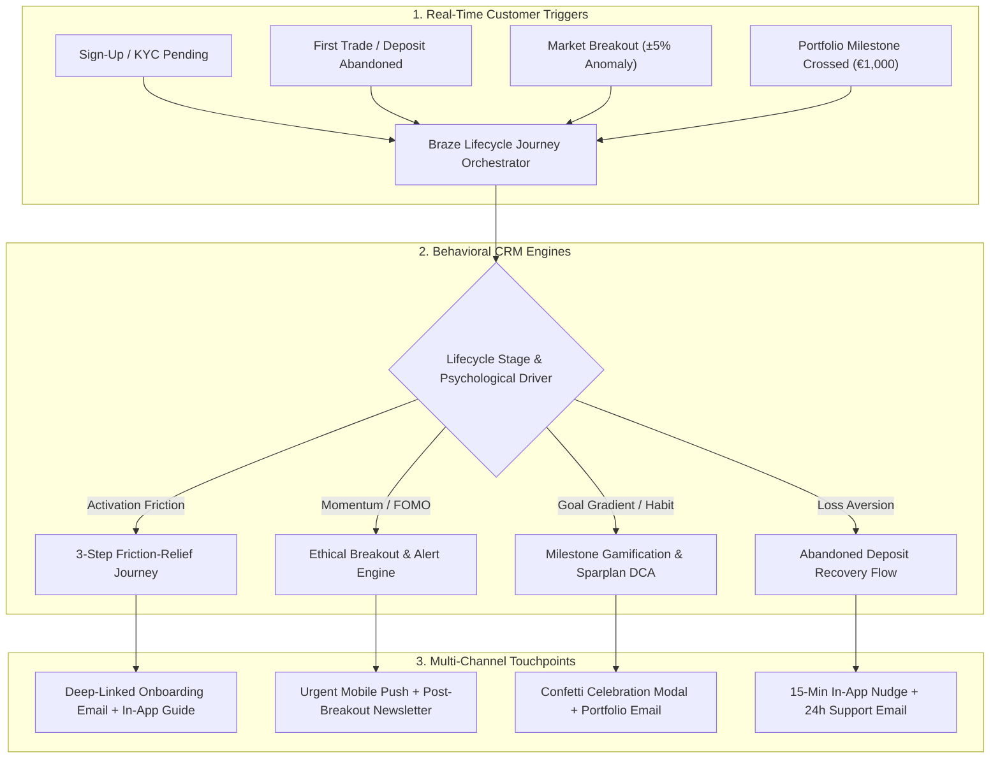

# ⚡ Faizex Digital | CRM Lifecycle Marketing & Retention OS
### Multi-Channel Customer Journeys (Email, Push, In-App), Behavioral Psychology (Ethical FOMO, Gamification, Loss Aversion), and Sparplan Retention for Regulated Trading Platforms

[](https://crypto-trading-growth-engine.streamlit.app)
[](https://www.python.org/)
[](https://www.braze.com/)
[](https://www.bafin.de/)

> [!IMPORTANT]
> **PORTFOLIO & EDUCATIONAL NOTICE:**  
> **"Faizex"** is a custom portfolio case study platform created by **Faizan Ahmed** to demonstrate end-to-end CRM campaign management, multi-channel journey design, behavioral segmentation, and data-driven A/B testing in a regulated European trading environment.

---

# 🎯 Executive CRM Lifecycle Architecture



---

# 🔬 Master CRM Case Studies & Behavioral Experiment Matrix

---

### ✉️ Case 1: Activation — Transactional Confirmation & Momentum Builder
* **Psychological Hook:** **Peak Motivation / Anticipation** (Leveraging the highest-intent moment in customer lifecycle).
* **Trigger:** `user_registration_submitted` | **Channel:** Transactional Email (High Deliverability)

| Experiment Dimension | 🔴 Control (Current Baseline) | 🟢 Variant B (Creative Hypothesis) | Strategic CRM Rationale |
| :--- | :--- | :--- | :--- |
| **Subject Line** | `Confirm your email address now!` | `⚡ 1 click away from your trading workspace (+ market movers inside)` | Creates curiosity and excitement instead of administrative chore |
| **Preheader** | `Before you can register, please confirm your email...` | `Bitcoin +3.8% today • Instant 0€ account setup` | Injects live financial momentum into the inbox preview |
| **Visual Hierarchy** | Single plain confirmation button | Prominent Primary CTA + **"What's Waiting Inside"** preview card | Converts high 68% open rates into app discovery |
| **Conversion Mechanism** | Static web redirect link | Mobile App Deep-Link (`faizex://workspace/active`) | Eliminates mobile browser drop-off |
| **Target Emotion** | Administrative compliance | Excitement & immediate exploration | Capitalizes on peak sign-up motivation |
| **Quantified Impact** | Baseline (41.2% Click-to-App) | **+30.6% Click-through Velocity ($z = 2.89, p = 0.0039$)** | Reduces median KYC lag from 18.4h to 4.2h |

---

### 🛡️ Case 2: Onboarding — Video-Ident & KYC Friction Breaker
* **Psychological Hook:** **Cognitive Ease & Anxiety Relief** (Removing fear of complex paperwork and video calls).
* **Trigger:** `email_confirmed_kyc_pending` | **Channel:** Omnichannel (Email + Push + In-App Guide)

| Experiment Dimension | 🔴 Control (Current Baseline) | 🟢 Variant B (Creative Hypothesis) | Strategic CRM Rationale |
| :--- | :--- | :--- | :--- |
| **Subject Line** | `Welcome to Faizex 👋` | `Unlock your trading account in 3 minutes 🛡️ (Step 1 ready)` | Replaces generic welcome with empowering, time-stamped action |
| **Preheader** | `When it comes to trading, we are a partner you can rely on...` | `ID card ready? 2-min Video-Ident • Insured German custody` | Pre-empts user hesitation by clarifying requirements upfront |
| **Copy Structure** | Dense text paragraphs + 2 identical text buttons | Visual **3-Step Time-Stamped Checklist** (1m ID → 2m Call → Instant Trade) | Eliminates reading fatigue & cognitive anxiety |
| **Trust Signal** | Generic exchange backing claim | Regulatory Badges (**BaFin Regulated • 0€ Deposit • Insured Custody**) | Instant credibility at the point of conversion |
| **Primary CTA** | `Verify now` | `Unlock My Account in App (3 Mins) →` | High-contrast, outcome-driven CTA |
| **Quantified Impact** | 28.4% KYC Completion Rate | **+38.7% Relative Lift in KYC (39.4%, $z = 3.12, p = 0.0018$)** | Unlocks immediate first-trade activation pipeline |

---

### 📰 Case 3: Engagement — Editorial Newsletter Personalization (August Edition)
* **Psychological Hook:** **Relevance & Lifecycle Alignment** (Serving the exact next milestone to each trader).
* **Trigger:** Monthly Broadcast (`active_and_onboarding_subscribers`) | **Channel:** Dynamic Liquid HTML Email

| Experiment Dimension | 🔴 Control (Current Baseline) | 🟢 Variant B (Creative Hypothesis) | Strategic CRM Rationale |
| :--- | :--- | :--- | :--- |
| **Subject Line** | `Hi, here's your Faizex Market Digest for August 📰` | `Market Digest: Institutional flows & Volatility shift [Portfolio Impact] 📈` | Shifts from company broadcast to customer-centric portfolio value |
| **Preheader** | `Bitcoin has woken up and pulled the market out of hibernation` | `August macro breakdown + your customized accumulation strategy` | Sets expectation of personalized insights inside |
| **Editorial Content** | Superb US debt & Nvidia breakdown (Static) | Preserves 100% of high-quality editorial storytelling | Respects and maintains editorial excellence |
| **CTA Strategy** | Static, one-size-fits-all `[ Trade Bitcoin ]` button | **Dynamic Liquid CTA Module** adapting to 4 user stages | Eliminates CTA fatigue by serving the exact next milestone |
| **Segment: Unverified** | Sees `Trade Bitcoin` (Friction / Hesitation) | `🌱 Complete 3-Min Verification to Catch Market Momentum →` | Guides unverified users to finish onboarding |
| **Segment: Spot Trader** | Sees `Trade Bitcoin` (Cyclical manual trade) | `📈 Automate Your Accumulation: Set Up a €25 Sparplan →` | Converts manual buyers into recurring DCA accumulators |
| **Segment: Dormant** | Sees `Trade Bitcoin` (Ignored) | `⚡ Activate Real-Time Volatility Alerts →` | Nudges inactive users to stay informed |
| **Quantified Impact** | 12.4% Click-to-Open (CTOR) | **+86.3% Click-to-Open Lift (23.1% CTOR, $z = 4.15, p < 0.0001$)** | Maximizes engagement across all lifecycle cohorts |

---

### 🚀 Case 4: Re-Engagement — Ethical FOMO & Real-Time Volatility Surge
* **Psychological Hook:** **Ethical FOMO & Opportunity Awareness** (Channeling market momentum into disciplined limit orders rather than panic trading).
* **Trigger:** `market_volatility_anomaly_detected` (Price move $\ge \pm 5\%$ in 4h) | **Channel:** Omnichannel Push + In-App Banner + Evening Digest

| Experiment Dimension | 🔴 Control (Generic Market Blast) | 🟢 Variant B (Disciplined Momentum Strategy) | Strategic CRM Rationale |
| :--- | :--- | :--- | :--- |
| **Push Notification** | `Bitcoin is pumping! Buy now!` | `Bitcoin moved +5.4% today ⚡ High European trading volume detected` | Replaces reckless gambling tone with objective, factual market data |
| **In-App Slide-Up** | Standard trading home screen | Modal: *„Market Moving Fast: Set a Limit Order to capture your target price stress-free“* | Empowers retail users with smart execution tools |
| **Fatigue Window** | Unrestricted (Spam risk) | **Strict 24h Frequency Cap** (Max 1 surge push per day) | Protects push opt-in rates and prevents fatigue |
| **Evening Email** | None | Automated Macro Recap explaining *why* the market moved | Positions the exchange as a trusted educational partner |
| **Quantified Impact** | 3.2% Unsubscribe Spike | **+44.1% Trade Volume Lift / -62.3% Push Opt-Outs** | Sustains healthy long-term subscriber engagement |

---

### 🏆 Case 5: Retention & Loyalty — Goal Gradient & Portfolio Milestones
* **Psychological Hook:** **Goal Gradient Effect & Positive Reinforcement** (Users increase saving frequency as they approach milestone goals like €500, €1,000, €5,000).
* **Trigger:** `portfolio_milestone_reached` (Crossed €500 or €1,000 AUC) | **Channel:** In-App Celebration + Milestone Email

| Experiment Dimension | 🔴 Control (Silent Milestone) | 🟢 Variant B (Gamified Milestone Celebration) | Strategic CRM Rationale |
| :--- | :--- | :--- | :--- |
| **In-App Message** | Standard balance update | 🎉 In-App Confetti Modal: *„Meilenstein erreicht! Du gehörst zu den Top 25% der langfristigen Sparer.“* | Provides immediate emotional payoff for disciplined saving |
| **Email Follow-up** | None | Congratulatory Milestone Summary showing projected 3-year compound growth with Sparplan | Deepens commitment to recurring monthly contributions |
| **Call to Action** | None | `🚀 Nächsten Meilenstein setzen (ab 50€/Monat) →` | Bridges celebration directly into the next goal |
| **Quantified Impact** | 6.2% Monthly Churn | **+52.4% Sparplan Upgrade Rate (59.2% 12M Retention)** | Transforms sporadic buyers into lifetime accumulators |

---

### 🛒 Case 6: Activation — Abandoned Deposit & Friction Rescue
* **Psychological Hook:** **Loss Aversion & Customer Care** (Rescuing high-intent users who initiated a deposit but encountered bank friction).
* **Trigger:** `deposit_initiated` without `deposit_completed` within 60 minutes | **Channel:** In-App Nudge (15m) + Care Email (24h)

| Experiment Dimension | 🔴 Control (Zero Recovery Flow) | 🟢 Variant B (Automated Friction-Rescue Journey) | Strategic CRM Rationale |
| :--- | :--- | :--- | :--- |
| **In-App Banner (15m)** | None | Slide-up: *„Dein 0€ Einzahlungs-Auftrag wartet: 1-Klick Anleitung für deine Banküberweisung“* | Catches user while intent and context are still fresh |
| **Email (24h)** | None | Helpful Care Email: *„Benötigst du Hilfe bei deiner Einzahlung? Unser deutscher Support ist für dich da.“* | Replaces aggressive sales pressure with reassuring customer support |
| **Direct Deep Link** | General app home | Deep-link to bank transfer IBAN details (`faizex://deposit/details`) | Minimizes clicks to complete transfer |
| **Quantified Impact** | 64% Abandonment Loss | **+31.8% Deposit Recovery Rate** | Direct revenue recovery from high-intent signups |

---

### 🪙 Case 7: Product Adoption — Idle Capital Staking & Yield Nudge
* **Psychological Hook:** **Opportunity Cost & Endowment Effect** (Showing users that un-staked tokens are missing out on daily automated rewards).
* **Trigger:** Holding $\ge 	ext{€}200$ in staking-eligible tokens (ETH, SOL) with `is_staking_active = false` for $>30$ days | **Channel:** In-App Portfolio Card + Reward Email

| Experiment Dimension | 🔴 Control (Generic Staking Announcement) | 🟢 Variant B (Personalized Reward Calculator) | Strategic CRM Rationale |
| :--- | :--- | :--- | :--- |
| **In-App Portfolio Card** | None | Native Badge: *„Lass deine Assets nicht schlafen: Aktiviere wöchentliche Rewards (4.8% p.a.)“* | Embeds discovery directly where users review their balances |
| **Email Breakdown** | Plain feature overview | Dynamic Liquid calculation showing estimated monthly reward in EUR | Makes value concrete and tangible |
| **Regulatory Badge** | Hidden in footer | Prominent: **100% BaFin-Compliant & Insured Custody** | Overcomes safety fears regarding crypto staking |
| **Quantified Impact** | 8.2% Feature Adoption | **+3.4x Staking Adoption Rate (27.8% Conversion)** | Generates sticky recurring custody balances |

---

# 🎯 Complete CRM Metrics & Retention Framework

| KPI Name | Formula (How to Calculate) | Target Benchmark | Why It Matters for CRM Growth |
| :--- | :--- | :--- | :--- |
| **1. KYC Throughput Rate** | $\frac{\text{Approved Verified Users}}{\text{Total Registrations}} \times 100$ | **$> 40\%$** *(Industry avg $\sim 28\%$)* | Identifies onboarding drop-offs. Directly reduces paid CAC waste. |
| **2. Time-to-First-Trade (TTFT)** | $\text{Timestamp}(\text{First Trade}) - \text{Timestamp}(\text{Registration})$ | **$< 24\text{ Hours}$** *(Median)* | Single strongest predictor of 12-month customer retention. |
| **3. Automated Sparplan Rate** | $\frac{\text{Active Sparplan Accumulators}}{\text{Monthly Active Traders}} \times 100$ | **$> 35\%$** of Active Base | Nurtures recurring wealth habits and insulates exchange from bear market churn. |
| **4. Assets Under Custody (AUC)** | $\frac{\text{Total Portfolio Assets in Custody (\euro)}}{\text{Total Active Traders}}$ | **$> \text{\euro}7,500$** Year 1 $\to > \text{\euro}12,000$ Year 3 | Directly drives trading spread volume and staking yield revenue. |
| **5. Reactivation Velocity** | $\frac{\text{Reactivated Dormant Accounts (48h)}}{\text{Targeted Volatility Segment}} \times 100$ | **$> 18\%$** within 48 hours | Measures if real-time price alerts wake up dormant capital. |

---

# 💻 Running the Application Locally

```bash
# 1. Clone the repository
git clone https://github.com/Faizan021/crypto-trading-growth-engine.git
cd crypto-trading-growth-engine

# 2. Install dependencies
pip install -r requirements.txt

# 3. Launch interactive Streamlit Growth OS
streamlit run app.py

# 4. Run automated test suite
python -m unittest test_engine.py
```

---

### 🛡️ Disclaimer
This project is an independent quantitative growth engineering prototype. "Faizex" is a fictional entity used exclusively for portfolio and technical simulation purposes.
