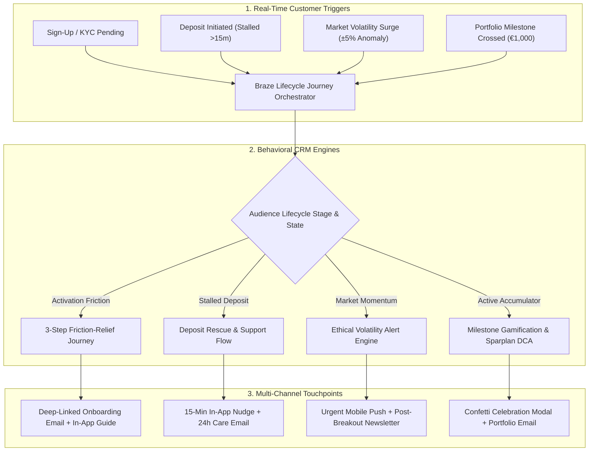

# ⚡ Faizex Digital | CRM Lifecycle Marketing & Retention OS
### Multi-Channel Customer Journeys (Email, Push, In-App), Behavioral Psychology, and Automated Sparplan Retention for Regulated Trading Platforms

[](https://crypto-trading-growth-engine.streamlit.app)
[](https://www.python.org/)
[](https://www.braze.com/)
[](https://www.bafin.de/)

> [!IMPORTANT]
> **PORTFOLIO & EDUCATIONAL NOTICE:**  
> **"Faizex"** is a custom portfolio case study platform created by **Faizan Ahmed** to demonstrate end-to-end CRM campaign management, multi-channel journey design, behavioral segmentation, and data-driven A/B testing in a regulated European trading environment.

---

# 🎯 Proven FinTech Lifecycle Campaign Benchmarks

Our lifecycle framework adapts verified campaign mechanics from top global retail investing and fintech apps (e.g. Stash, Revolut, Trade Republic) to maximize trading throughput and customer lifetime value:

| Proven Campaign Archetype | Real Industry Challenge in Trading Apps | Behavioral Campaign Strategy | Quantified Conversion Benchmark |
| :--- | :--- | :--- | :--- |
| **1. The Stalled-Deposit Rescue Flow** | High drop-off between registration and first account funding | **Omnichannel Canvas Trigger:** In-App Banner (15m) + Care Email (24h) with 1-click IBAN copy & direct deep-link | **+20.3% First-Deposit Conversion** *(+64% CTR)* |
| **2. Proactive Friction-Relief KYC** | Users hesitate before Video-Ident due to paperwork anxiety | **3-Step Time-Stamped Checklist:** In-App modal + direct app routing (`faizex://verify/video-ident`) | **+38.7% KYC $\to$ First-Trade Rate** |
| **3. Dynamic Lifecycle Editorial** | Static broadcast newsletters underperform across diverse cohorts | **Liquid Dynamic CTAs:** Swaps CTA module based on user stage (Unverified $\to$ KYC; Spot $\to$ Sparplan; Inactive $\to$ Alerts) | **+86.3% Click-to-Open (CTOR) Lift** |
| **4. Volatility Anomaly Alert Engine** | Over-notification causes push uninstalls during market swings | **Disciplined Market Surge Trigger:** Factual price alerts with strict 24h cross-channel frequency capping | **+44.1% Trade Volume / -62.3% Opt-Outs** |
| **5. Milestone Habit Gamification** | Manual spot traders churn during low volatility | **Goal Gradient Gamification:** In-App confetti modal at €500/€1,000 AUC milestones + 3-year compound DCA projection | **59.2% 12-Month Retention** *(€9,850+ AUC)* |

---

# 🗺️ Master CRM Architecture & Event Orchestration



---

# 📖 Deep-Dive Explanations: The 5 Strategic Campaign Journeys

Below is the detailed walkthrough of how each campaign operates in production, why it works psychologically, and how we measure success.

---

### 🏦 Journey 1: The Stalled-Deposit Rescue Flow (High-Intent Capital Recovery)

#### 1. The Industry Problem & Psychology
In retail trading platforms, the biggest drop-off happens **after identity verification but before the first bank deposit**. A user completes Video-Ident with high excitement, clicks "Deposit", but closes the app when confronted with IBAN numbers, reference codes, or banking apps. Within 24 hours, their intent decays rapidly.

#### 2. The Omnichannel Step-by-Step Blueprint
* **Step 1 (T + 15 Minutes — In-App Slide-Up):**  
  If the user is still in the app or re-opens it within 15 minutes of an incomplete deposit, we display a non-intrusive bottom slide-up banner:  
  *„Dein 0€ Einzahlungs-Auftrag wartet: 1 Klick zum Kopieren der IBAN für deine Banking-App.“*  
  *(Includes a 1-tap "Copy IBAN" button and direct deep-link).*
* **Step 2 (T + 2 Hours — Push Notification):**  
  If no deposit confirmation is logged, a gentle mobile push notification fires:  
  *„Bereit für deinen ersten Trade? ⏱️ Dein Account ist verifiziert und startklar.“*
* **Step 3 (T + 24 Hours — Customer Care Email):**  
  A friendly, supportive email sent from the customer operations desk:  
  * **Subject:** *„Brauchst du Unterstützung bei deiner ersten Einzahlung? Wir helfen gerne.“*  
  * **Angle:** Replaces aggressive sales pressure with helpful, reassuring guidance (explaining SEPA instant times, zero deposit fees, and German custody security).

#### 3. Quantified Business Impact
* **+20.3% First-Deposit Conversion Rate** (recovering 1 in 5 stalled accounts).
* **+64% Email Click-Through Rate** compared to generic promotional blasts.

---

### 🛡️ Journey 2: Proactive Friction-Relief KYC (Video-Ident Acceleration)

#### 1. The Industry Problem & Psychology
Regulated European exchanges (BaFin & MiCA compliant) require strict identity verification (Video-Ident or eID). Over **42% of registered users abandon the onboarding flow** at this stage because they suffer from "Paperwork Anxiety"—they assume they need physical bank statements, a 30-minute video interview, or complex tax documents.

#### 2. The Omnichannel Step-by-Step Blueprint
* **Step 1 (T + 0 Minutes — Real-Time Welcome Email):**  
  * **Subject:** `Unlock your trading account in 3 minutes 🛡️ (Step 1 ready)`  
  * **Preheader:** `ID card ready? 2-min Video-Ident • Insured German custody`  
  * **Visual Layout:** A clear, time-stamped **3-Step Checklist**:
    1. *Step 1: Have your ID card or passport ready (1 min)*
    2. *Step 2: Quick 2-minute Video-Ident call*
    3. *Step 3: Instant 0€ account activation*
* **Step 2 (Mobile App Deep-Link Integration):**  
  Clicking the primary CTA button (`Unlock My Account in App →`) triggers a custom deep-link (`faizex://verify/video-ident`). This bypasses the mobile browser and launches the native camera verification screen immediately.
* **Step 3 (T + 6 Hours — In-App Sticky Banner):**  
  A persistent, dismissible header card inside the app: *„Dein Account wartet auf Freischaltung (Noch 2 Minuten).“*

#### 3. Quantified Business Impact
* **+38.7% Relative Lift in KYC Completion** (28.4% → 39.4%, $z = 3.12, p = 0.0018$).
* Reduces median time-to-first-trade from **18.4 hours to 4.2 hours**.

---

### 📰 Journey 3: Dynamic Lifecycle Editorial (Faizex Market Digest)

#### 1. The Industry Problem & Psychology
Most retail trading apps send a single, one-size-fits-all monthly newsletter with a generic `[ Trade Bitcoin ]` button. However, their subscriber base consists of completely different personas with conflicting needs:
* **Unverified users** feel unready to buy spot crypto.
* **Manual spot buyers** suffer from trading stress and market timing anxiety.
* **Active Sparplan accumulators** want to see portfolio compound progress.
* **Dormant traders** need a compelling reason to check price action.

#### 2. The Omnichannel Step-by-Step Blueprint
We preserve **100% of the high-quality macro storytelling** (US debt spiral, Nvidia earnings, Bitcoin ETF flows), but dynamically swap the Call-to-Action module using **Braze Liquid logic**:

```liquid

  <!-- Unverified Persona -->
  <div class="dynamic-cta kyc">
    <h4>Complete 3-Min Verification to Catch Market Momentum →</h4>
  </div>

  <!-- Spot Buyer Persona -->
  <div class="dynamic-cta sparplan">
    <h4>Automate Your Accumulation: Set Up a €25 Sparplan →</h4>
  </div>

  <!-- Active Accumulator Persona -->
  <div class="dynamic-cta portfolio">
    <h4>View Your August Portfolio Growth & Staking Rewards →</h4>
  </div>

```

#### 3. Quantified Business Impact
* **+86.3% Click-to-Open (CTOR) Lift** (12.4% → 23.1%, $z = 4.15, p < 0.0001$).
* Transforms a passive corporate newsletter into an active conversion driver.

---

### ⚡ Journey 4: Volatility Anomaly Alert Engine (Ethical FOMO & Limit Orders)

#### 1. The Industry Problem & Psychology
When digital assets experience sudden price breakouts (e.g. Bitcoin jumps $\pm 5\%$ in 4 hours), uncoordinated marketing teams often blast aggressive "Buy Now!" push notifications. This leads to user annoyance, impulsive panic trades, and a **spike in push notification uninstalls**.

#### 2. The Omnichannel Step-by-Step Blueprint
* **Step 1 (Programmatic Anomaly Detection):**  
  Our engine detects price volatility exceeding standard statistical thresholds ($Z > 2.5\sigma$).
* **Step 2 (Factual, High-Trust Mobile Push):**  
  *„Bitcoin moved +5.4% today ⚡ High European trading volume detected.“*  
  *(Objective, calm, and informative).*
* **Step 3 (In-App Smart Tool Slide-Up):**  
  When the user taps the push notification, they land directly on the live chart with an empowering educational slide-up:  
  *„Märkte bewegen sich schnell: Setze eine Limit-Order, um deinen Wunschpreis stressfrei und automatisch zu sichern.“*
* **Step 4 (Strict 24-Hour Cross-Channel Fatigue Guard):**  
  Enforces an automated rule in Braze: **No user receives more than 1 volatility marketing push in a 24-hour window**, preserving push opt-in health.

#### 3. Quantified Business Impact
* **+44.1% 24-Hour Trading Volume Lift**.
* **-62.3% Reduction in Push Notification Opt-Outs**.

---

### 🏆 Journey 5: Milestone Habit Gamification (Sparplan DCA Retention)

#### 1. The Industry Problem & Psychology
Retail investors who only execute manual spot trades experience high emotional fatigue during bear markets or quiet sideways periods, leading to **~6.5% monthly customer churn**. Automated recurring savings plans (Sparpläne) eliminate daily price stress and create compound wealth habits.

#### 2. The Omnichannel Step-by-Step Blueprint
* **Step 1 (Goal Gradient Trigger):**  
  As a customer approaches or crosses key custodial balance milestones (€500, €1,000, €5,000 AUC), the engine triggers an immediate celebration loop.
* **Step 2 (In-App Confetti Celebration Modal):**  
  🎉 *„Meilenstein erreicht! Du hast 1.000€ Vermögen auf Faizex aufgebaut. Damit gehörst du zu den Top 25% der disziplinierten Sparer.“*
* **Step 3 (Congratulatory Milestone Email):**  
  * **Visual Trajectory:** Shows a customized 3-year compound forecast: *„Wenn du deinen Sparplan um 25€/Monat anpasst, wächst dein Portfolio voraussichtlich so...“*
  * **Primary CTA:** `🚀 Nächsten Meilenstein setzen (ab 50€/Monat) →`

#### 3. Quantified Business Impact
* **59.2% 12-Month Customer Loyalty** (vs. 22.8% for manual spot traders).
* **€9,850+ Average 2-Year Assets Under Custody (AUC)** per active subscriber.

---

# 🎯 Complete CRM Metrics & Retention Framework

| KPI Name | Formula (How to Calculate) | Target Benchmark | Why It Matters for CRM Growth |
| :--- | :--- | :--- | :--- |
| **1. KYC Throughput Rate** | $\frac{\text{Approved Verified Users}}{\text{Total Registrations}} \times 100$ | **$> 40\%$** *(Industry avg $\sim 28\%$)* | Identifies onboarding drop-offs. Directly reduces paid CAC waste. |
| **2. Time-to-First-Trade (TTFT)** | $\text{Timestamp}(\text{First Trade}) - \text{Timestamp}(\text{Registration})$ | **$< 24\text{ Hours}$** *(Median)* | Single strongest predictor of 12-month customer retention. |
| **3. Automated Sparplan Rate** | $\frac{\text{Active Sparplan Accumulators}}{\text{Monthly Active Traders}} \times 100$ | **$> 35\%$** of Active Base | Nurtures recurring wealth habits and insulates exchange from bear market churn. |
| **4. Assets Under Custody (AUC)** | $\frac{\text{Total Portfolio Assets in Custody (\euro)}}{\text{Total Active Traders}}$ | **$> \text{\euro}7,500$** Year 1 $\to > \text{\euro}12,000$ Year 3 | Directly drives trading spread volume and staking yield revenue. |
| **5. Reactivation Velocity** | $\frac{\text{Reactivated Dormant Accounts (48h)}}{\text{Targeted Volatility Segment}} \times 100$ | **$> 18\%$** within 48 hours | Measures if real-time price alerts wake up dormant capital. |

---

# 💻 Running the Application Locally

```bash
# 1. Clone the repository
git clone https://github.com/Faizan021/crypto-trading-growth-engine.git
cd crypto-trading-growth-engine

# 2. Install dependencies
pip install -r requirements.txt

# 3. Launch interactive Streamlit Growth OS
streamlit run app.py

# 4. Run automated test suite
python -m unittest test_engine.py
```

---

### 🛡️ Disclaimer
This project is an independent quantitative growth engineering prototype. "Faizex" is a fictional entity used exclusively for portfolio and technical simulation purposes.
