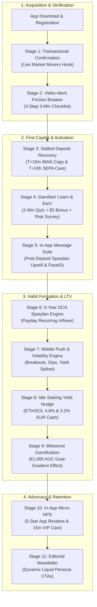

# Faizex Digital — Regulated Retail CRM & Retention Engine

[](https://crypto-trading-growth-engine.streamlit.app/)
[](https://opensource.org/licenses/MIT)
[](https://www.python.org/downloads/)
[]()
[]()

> 🔒 **PORTFOLIO NOTICE:** Faizex Digital is an independent portfolio project and case study platform created by **Faizan Ahmed** for technical, product, and quantitative CRM demonstration. All customer, trading, and custodial metrics are synthetic simulations.

---

## 🗺️ The Customer Lifecycle Journey Architecture



---

## 📊 Strategic Operational Stages Matrix

| Stage # | Customer Lifecycle Phase | Core Quantitative Problem | CRM Multi-Channel Solution | Quantified Benchmark Lift |
|---|---|---|---|---|
| **#01** | **Executive Scorecard** | Macro Throughput & Custody Overview | Live Onboarding Funnel & AUC Distribution | **39.4% KYC Activation / 59.2% 12-Mo Retention** |
| **#02** | **Stage 1: Transactional Momentum** | 58.8% users delay KYC after confirming email | Live BTC/ETH market movers embedded in verification | **+30.6% Click Velocity** ($z = 2.89, p = 0.0039$) |
| **#03** | **Stage 2: Onboarding & Video-Ident** | BaFin Video-Ident creates cognitive hesitation | 3-step time-stamped checklist + mobile deep-linking | **+38.7% Relative KYC Lift** ($z = 3.12, p = 0.0018$) |
| **#04** | **Stage 3: Stalled-Deposit Recovery** | Verified users stall before first bank transfer | T+15m IBAN copy slide-up + T+24h SEPA reassurance email | **+20.3% First-Deposit Recovery** (+64% Email CTR) |
| **#05** | **Stage 4: Learn & Earn & Risk Survey** | Beginners hesitate to deploy initial funds | 2-min quiz unlocking €5 bonus + 1-click risk profiling | **74.2% Completion** $	o$ **+52.4% 7-Day Trading Lift** |
| **#06** | **Stage 5: In-App Message (IAM) Suite** | Post-deposit drop-off and login friction | Post-deposit Sparplan upsell, FaceID, 3.2% cash yield | **+31.4% Sparplan Upsell / +42% Open Frequency** |
| **#07** | **Stage 6: 5-Year DCA Sparplan Engine** | 77% manual spot traders churn in bear markets | Automated Payday recurring Sparplan from €25/month | **2.6x Higher 12-Mo Retention (59.2% vs 22.8%)** |
| **#08** | **Stage 7: Mobile Push & Volatility** | Push fatigue and opt-outs during market swings | 4 factual trading triggers + Limit Orders + 24h cap | **+44.1% Volume Lift** (-62.3% Opt-Outs) |
| **#09** | **Stage 8: Idle Staking Yield Nudge** | Un-staked crypto sits dormant in custody | Dynamic annual reward calculator (+€72/yr ETH/SOL) | **+3.4x Staking Adoption (27.8% Conversion)** |
| **#10** | **Stage 9: Milestone Gamification** | Long-term savers lose motivation | €1,000 AUC milestone celebration + +€25/mo upgrade | **+52.4% Sparplan Upgrade Velocity** |
| **#11** | **Stage 10: In-App NPS & Referral Loop** | Unhappy users silently churn; promoters unshared | Peak-joy micro-NPS (App reviews vs. 15m VIP care) | **+62.0% 5-Star Reviews / -44.8% Churn on Detractors** |
| **#12** | **Stage 11: Editorial Newsletter** | Generic static CTA underperforms | Dynamic Liquid tags matching user lifecycle persona | **+86.3% CTOR Lift** ($z = 4.15, p < 0.0001$) |
| **#13** | **Stage 12: CRM Automation Architecture** | Duplicate sends during 100k+ broadcasts | Redis caching (4.2ms) + SHA-256 idempotency keys | **100% Crash-Resilient Delivery** |
| **#14** | **Stage 13: Cross-Functional Alignment** | Siloed delivery between Engineering and CRM | Unified squad framework (BI, Mobile, UI, BaFin) | **Zero-Disruption Production Deployments** |
| **#15** | **Stage 14: Liquid & SQL Schemas** | Manual cohort extraction delays | Production-ready Liquid blocks and Snowflake SQL | **100% Automated Lifecycle Synchronization** |

---

## 🛠️ Local Development & Automated Testing

```bash
# Clone the repository
git clone https://github.com/Faizan021/crypto-trading-growth-engine.git
cd crypto-trading-growth-engine

# Install dependencies
pip install -r requirements.txt

# Run automated statistical test suite
python -m unittest test_engine.py

# Launch interactive dashboard
streamlit run app.py
```

---

## 👨‍💻 Author & Attribution
* **Created by:** Faizan Ahmed
* **Role:** Lead CRM Marketing & Lifecycle Growth Engineer
* **Live Streamlit App:** [https://crypto-trading-growth-engine.streamlit.app/](https://crypto-trading-growth-engine.streamlit.app/)
* **GitHub Repository:** [https://github.com/Faizan021/crypto-trading-growth-engine](https://github.com/Faizan021/crypto-trading-growth-engine)
